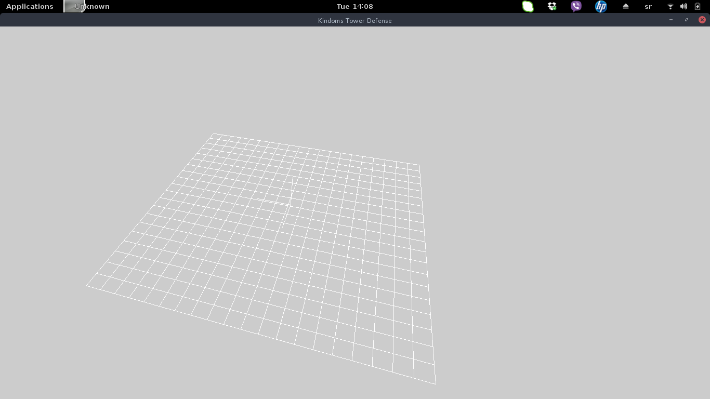

Odradjeno:
  - kreirana osnovna struktura projekta
  - inicijalizacija prozora
  - inicilaizacija prespektive
  - napravljena osa radi lakse orjentacije
  - napravljena mreza na osnovu koje se pravi pod

Planirano za sledecu nedelju:
  - popravi funcija za risajzovanje prozora
  - naprave funcije za ucitavanje objekata i slika

