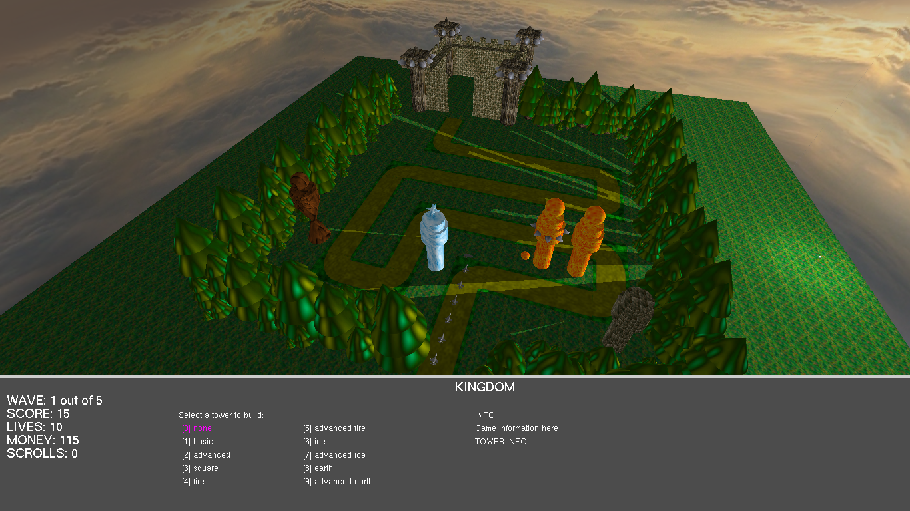

Odradjeno:
 - ubacene funkcije za animaciju vojnika, posto za date modele nisam znao kako da implementriam animaciju, ubacio sam modele aviona gde mi je bilo lakse da animiram kreatenje
 - ubacene funkcije za obradu udarca, detekcija kada dodje do sudara pucnja i vojnika, obrada se vrsi tako sto uporedjujemo da li su se dve sfere poklopile
 - ubacene funkcije za obradu senki na zamlji
 - ubacenje funkcije za prikaz teksta u sidebaru
 - dovrsene funkcije za detekciju kula i selekciju kao i postavljanje na zemlju
 - ubacene funkcije za crtanje suma
 - doradjen je makefile, i odradjena bolja struktura fajlova

Projekat je zavrsen, ima los fps pri prikazivanju sume, ali moze da se prepravi stiskom da dugme f cime se uklanja suma iz igre.

