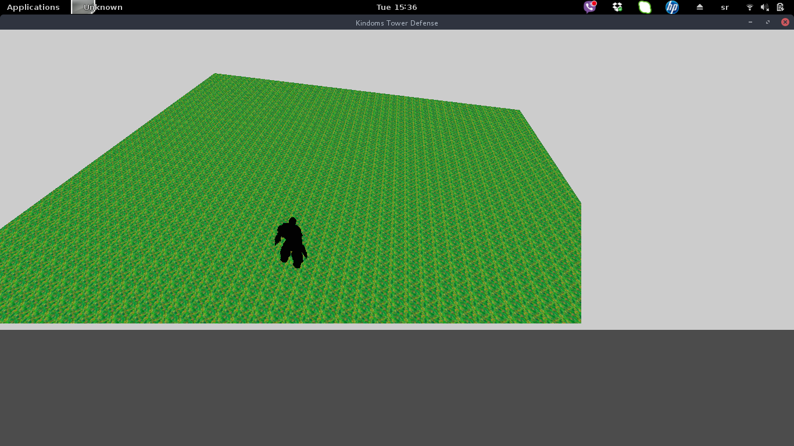

Odradjeno:
 - napravljenje funkcije za ucitavanje objekta
 - napravljenje funkcije za pravljenje objekta
 - napravljenje funkcije za inicijalizaciju i pravljenje pomocnog prozora
 - prepavljenje funkcije za promenu velicine prozora

Planirano za sledecu nedelju:
 - dodatne podesavanja za promenu velicinu prozora
 - napraviti osnovne objekte kao lopta, pravougaonik
 - napraviti od osnovnih objekata dvorac i kule  
 
 